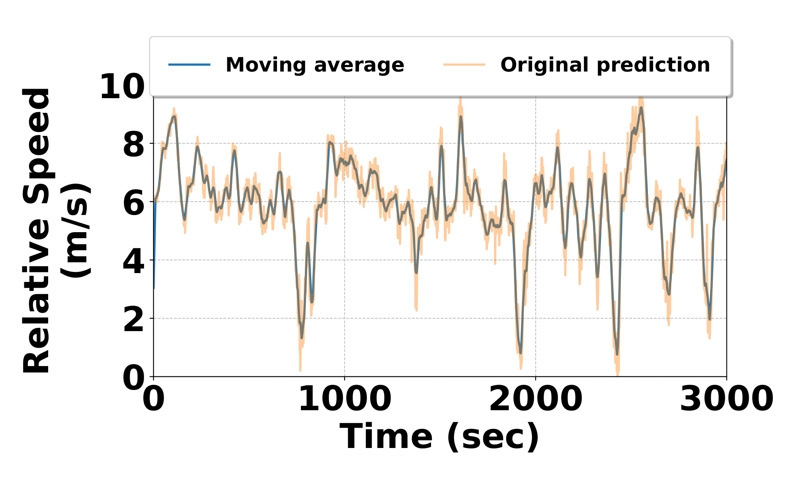

## Results
As shown in Fig. 1, the predicted velocities closely align with ground truth values, indicating a high degree of accuracy. The error distribution plot in Fig. 2 highlights a prominent peak at zero residuals, signifying that the majority of predictions are highly accurate with minimal deviation from the true values. 

After velocity estimation, a post-processing step is applied to smooth the predictions over time. A moving average filter is used to reduce short-term noises in the velocity predictions, ensuring a more consistent and reliable output as shown in Fig. 3.

    
    
<b>Figure 1:</b> Predicted Vs Ground Truth .

    
    
<b>Figure 2:</b> Prediction Error Distribution. 

    
    
<b>Figure 3:</b> : Impact of moving average on raw model estimation. 

## Radar Configuration
This is radar configuration we have used
| **Parameters**                  | **Value**       |
|----------------------------------|-----------------|
| Start Frequency (GHz)           | 77              |
| Range Resolution (m)            | 0.244           |
| Maximum Unambiguous Range (m)   | 50              |
| Maximum Radial Velocity (m/s)   | 7.2             |
| Radial Velocity Resolution (m/s)| 0.9             |
| Frames per Second               | 4               |
| Azimuth Resolution (deg)        | 15              |
| Baud-rate                       | 921600 bps      |
| RANGE_RESOLUTION                | 0.244           |
| DOPPLER_RESOLUTION              | 0.13            |

## Baseline Processing
The following section describes detailted discussion how distance and velocity is calculated in different modalities.  
### LiDAR

The LiDAR data processing invloves analyzing the largest cluster of points detected in the front view. It calculates the distance to the cluster's centroid, which can be used for velocity estimation in subsequent iterations. As done in [1] The method begins by converting the LiDAR data from polar coordinates into Cartesian coordinates, where each point's distance and angle are used to calculate its x and y positions in a 2D plane. The points clustered using the DBSCAN algorithm, grouping nearby points based on a specified neighborhood radius and a minimum number of points required to form a cluster. Points classified as noise, which do not belong to any cluster, are excluded from further analysis. Among the identified clusters, the largest valid cluster is selected. We calculate the centroid of this cluster. The distance from the sensor to the centroid is computed using the Euclidean norm, representing the detected object's distance from the sensor. Consecutive distance is computed iteratively. The velocity is calculated using the formula v = Δd / Δt, where Δd is the change in distance between successive scans, and Δt is the time elapsed. If no valid clusters are found, the method returns None, indicating that no significant objects were detected.

### Doppler
To process doppler data for estimating  distance and its relative speed. We iterate the data, focusing on a specific range of interest. For each data frame, the summed Doppler data across the range dimension is cropped to focus on a specific distance window (1.5m to 6m). Within this cropped range, our method identifies peaks using the find_peaks function, where a peak represents a significant reflection power from an object. The peak with the highest intensity is selected, and its index is used to compute the distance to the front car by multiplying the index by RANGE_RESOLUTION. If no peaks are detected, it prints a "peak missing" message. For relative speed estimation, the Doppler slice corresponding to the highest peak's range is extracted, representing Doppler shifts at that range. The index of the maximum Doppler shift (top Doppler index) is used to determine the relative velocity. If the index indicates a positive shift, it corresponds to a receding object, to obtain the velocity we multiply selected index value with negetive DOPPLER_RESOLUTION. If the index is neutral (centered at 8), the relative speed is zero. For a negative shift, it corresponds to an approaching object. We multiply selected index values with postive DOPPLER_RESOLUTION. To the best of our knowledge, this is a self-defined baseline, as the current literature does not include any work that measures vehicle speed and distance using the mmWave radars employed in our study.

### Camera
To estimate relative velocity and distance of front car from video data we analyze their movement between frames. We used YOLOv3 object detection model [2]. As the video is read frame by frame, the function processes each frame into a blob, which is passed through the YOLOv3 model to detect vehicle. Bounding boxes for detected vehicles are filtered based on confidence scores and stored in a buffer to track their movement over time. For each detected vehicle, the width of the bounding box is used to estimate its distance from the camera using a real-world car width and focal length of the camera. We calculates the median width of the bounding boxes, estimates the distance to the vehicle, and computes the relative velocity by comparing the current distance with the previous distance, factoring by frame rate. After each frame bounding box buffer is cleared. This process is repeated for the entire video, for continuous vehicle tracking and velocity estimation.
### IMU
Acceleration is extracted from the Ax (g) column, representing acceleration along the x-axis. As done in [3] the velocity is calculated iteratively by adding the product of acceleration and time interval to the previous velocity using the formula:
v[i] = v[i-1] + a[i] * Δt. Distance is similarly computed by adding the product of the current velocity and the time interval to the previous distance using the formula: d[i] = d[i-1] + v[i] * Δt. 

## CarVision Application

    
    
<b>Figure 4:</b> creenshots of the Android application for driver
assistance.(Left) Danger alert mode: the system detects if the vehicle is too close and prompts a warning. (Right) Safe driving mode: the system detects if the vehicle is at a safe distance.

    

### Android Application Integration
To demonstrate the practical application of our system, we also developed an Android application that interacts with the real-time inference results of CArVision The inference results are transmitted via a WiFi socket to the Android application, which reads the data and updates the driver's real-time notification status.The application provides two key safety features: (1) Proximity Alert The app alerts the driver when the front vehicle is too close, i.e., when the relative speed separation between the two vehicles becomes critically low, (2) Movement Alert: The app also notifies the driver when the vehicle ahead is at a safe distance.

Figure 4 illustrates the interface of the application when the distance is deemed safe, and  shows the alert interface when the vehicle is too close or in potential danger. These real-time notifications are based on the predicted velocity estimations of CarVision, demonstrating its effectiveness in practical real-driving assistance.

### Time Synchronization
To achieve time synchronization across all devices, we connected the mobile phone's Wi-Fi hotspot to the laptop. This ensured that the laptop adopted the mobile phone's system time as the reference. The mmWave radar and other modalities, including LiDAR and the camera, were connected to the laptop, ensuring all these devices operated on the same synchronized timeline. For IMU data we used andriod application called IMULog, which directly logs the data in smart phone.
For ground truth data collection, we used the OBDELM-II sensor, which was paired with the smartphone via Bluetooth. The data was logged directly on the smartphone, maintaining consistency with the mobile phone's reference time. This approach effectively addressed the challenge of time synchronization across all devices and modalities.  

## References
1. L. Deng, T. Guo, H. Wang, Z. Chi, Z. Wu, and R. Yuan, “Obstacle
detection of unmanned surface vehicle based on lidar point cloud data,”
in OCEANS 2022, Hampton Roads. IEEE, 2022, pp. 1–8.
2. “Yolo V5 Car Object Detection — kaggle.com,” https://www.kaggle.
com/code/balraj98/yolo-v5-car-object-detection, [Accessed January 16,
2025].
3. T. Lei, A. A. Mohamed, and C. Claudel, “An imu-based traffic and road
condition monitoring system,” HardwareX, vol. 4, p. e00045, 2018.

