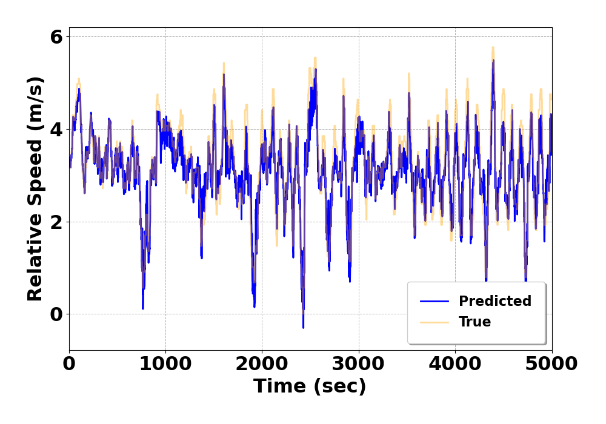
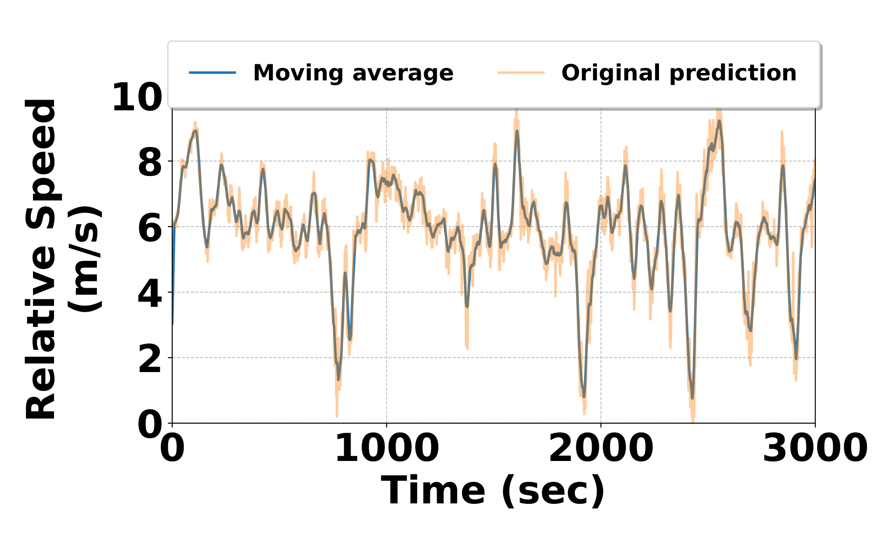

# CarVision
Maintaining a safe distance from the vehicle ahead
is critical for safe driving. While LiDAR sensors can be used
for distance measurement, their high cost and the large number
of vehicles without such sensors—especially in developing re-
gions—necessitate a low-cost yet effective alternative. To address
this, we introduce CarVision , a system that utilizes a commer-
cially available single-chip mmWave radar mounted on a car’s
dashboard for vehicle ranging. CarVision detects vehicles within
the radar’s field of view (FoV) and computes both the distance
and relative speed of the vehicles in front. Our system employs
a novel hybrid approach for vehicle detection and tracking,
combining deep neural network-based detection with range
tracking in a streamlined pipeline to optimize both accuracy and
speed. Additionally, we’ve developed a smartphone-based alert
system that warns drivers if a vehicle approaches within a crit-
ical distance (approximately 2 meters). CarVision demonstrates
reliable ranging performance in both daytime and nighttime
conditions, with accurate measurements up to 10 meters.

<!-- 

### Model Prediction with moving average
 -->

    
    
<b>Figure 1:</b> Predicted Vs Ground Truth .

    
    
<b>Figure 2:</b> Predicted Vs Ground Truth with moving average .

## Radar Configuration
### This is radar configuration we have used
| **Parameters**                  | **Value**       |
|----------------------------------|-----------------|
| Start Frequency (GHz)           | 77              |
| Range Resolution (m)            | 0.244           |
| Maximum Unambiguous Range (m)   | 50              |
| Maximum Radial Velocity (m/s)   | 7.2             |
| Radial Velocity Resolution (m/s)| 0.9             |
| Frames per Second               | 4               |
| Azimuth Resolution (deg)        | 15              |
| Baud-rate                       | 921600 bps      |
| RANGE_RESOLUTION                | 0.244           |
| DOPPLER_RESOLUTION              | 0.13      |

## Baseline Processing
The following sections describe detailted discussion how distance and velocity is calculated with different modalities.  
### LiDAR

The LiDAR data processing invloves analyzing the largest cluster of points detected in the front view. It calculates the distance to the cluster's centroid, which can be used for velocity estimation in subsequent iterations. The method begins by converting the LiDAR data from polar coordinates into Cartesian coordinates, where each point's distance and angle are used to calculate its x and y positions in a 2D plane. The points clustered using the DBSCAN algorithm [1], grouping nearby points based on a specified neighborhood radius and a minimum number of points required to form a cluster. Points classified as noise, which do not belong to any cluster, are excluded from further analysis. Among the identified clusters, the largest valid cluster is selected. We calculate the centroid of this cluster. The distance from the sensor to the centroid is computed using the Euclidean norm, representing the detected object's distance from the sensor. Consecutive distance is computed iteratively. The velocity is calculated using the formula v = Δd / Δt, where Δd is the change in distance between successive scans, and Δt is the time elapsed. If no valid clusters are found, the method returns None, indicating that no significant objects were detected.

### Doppler
To process doppler data for estimating  distance and its relative speed. We iterate the data, focusing on a specific range of interest. For each data frame, the summed Doppler data across the range dimension is cropped to focus on a specific distance window (1.5m to 6m). Within this cropped range, our method identifies peaks using the find_peaks function, where a peak represents a significant reflection power from an object. The peak with the highest intensity is selected, and its index is used to compute the distance to the front car by multiplying the index by RANGE_RESOLUTION. If no peaks are detected, it prints a "peak missing" message. For relative speed estimation, the Doppler slice corresponding to the highest peak's range is extracted, representing Doppler shifts at that range. The index of the maximum Doppler shift (top Doppler index) is used to determine the relative velocity. If the index indicates a positive shift, it corresponds to a receding object, to obtain the velocity we multiply selected index value with negetive DOPPLER_RESOLUTION. If the index is neutral (centered at 8), the relative speed is zero. For a negative shift, it corresponds to an approaching object. We multiply selected index values with postive DOPPLER_RESOLUTION. To the best of our knowledge, this is a self-defined baseline, as the current literature does not include any work that measures vehicle speed and distance using the mmWave radars employed in our study.

### Camera
To estimate relative velocity and distance of front car from video data we analyze their movement between frames. We used YOLOv3 object detection model [2]. As the video is read frame by frame, the function processes each frame into a blob, which is passed through the YOLOv3 model to detect vehicle. Bounding boxes for detected vehicles are filtered based on confidence scores and stored in a buffer to track their movement over time. For each detected vehicle, the width of the bounding box is used to estimate its distance from the camera using a real-world car width and focal length of the camera. We calculates the median width of the bounding boxes, estimates the distance to the vehicle, and computes the relative velocity by comparing the current distance with the previous distance, factoring by frame rate. After each frame bounding box buffer is cleared. This process is repeated for the entire video, for continuous vehicle tracking and velocity estimation.
### IMU
Acceleration is extracted from the Ax (g) column, representing acceleration along the x-axis. Velocity is calculated iteratively by adding the product of acceleration and time interval to the previous velocity using the formula:
v[i] = v[i-1] + a[i] * Δt. Distance is similarly computed by adding the product of the current velocity and the time interval to the previous distance using the formula: d[i] = d[i-1] + v[i] * Δt. 

## References
1. L. Deng, T. Guo, H. Wang, Z. Chi, Z. Wu, and R. Yuan, “Obstacle
detection of unmanned surface vehicle based on lidar point cloud data,”
in OCEANS 2022, Hampton Roads. IEEE, 2022, pp. 1–8.
2. “Yolo V5 Car Object Detection — kaggle.com,” https://www.kaggle.
com/code/balraj98/yolo-v5-car-object-detection, [Accessed January 16,
2025].
3. T. Lei, A. A. Mohamed, and C. Claudel, “An imu-based traffic and road
condition monitoring system,” HardwareX, vol. 4, p. e00045, 2018.

